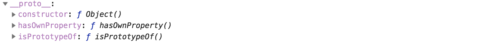
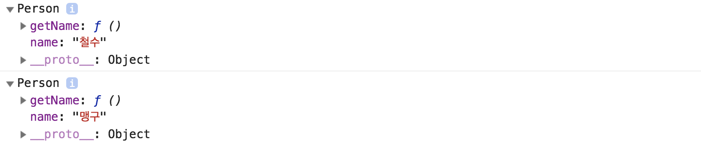

# 08. 프로토타입\(Prototype\)

## 프로토타입 \(Prototype\)

### 들어가며

JS는 다른 언어 Java, Python과 같이 관련된 것들을 묶어 class 내용을 바탕으로 인스턴스를 생성하는데 JS에는 class라는 개념이 존재하지 않습니다. 대신 프로토타입을 기반으로 객체를 생성, 상속, 모듈화 할 수 있습니다.  
ES6에는 class가 등장하였으나 결국 프로토타입 기반으로 동작을 합니다.

### 프로토타입은 어떻게 만드나요?

프로토타입을 선언하는 방법은 아래와 같습니다.

```javascript
대상.prototype.메서드이름 = function(){ // do Something... }
```

### 프로토타입이 뭐에요 ? 

모든 객체는 생성이 될 때 자신을 만든 객체와의 연결된 링크를 가지고 있는데 이것이 프로토타입입니다.   
두 가지 종류의 프로토타입이 존재하는데 크게 두 가지를 묶어 프로토타입이라고 부릅니다.

1. 자신을 통해 만들어질 객체들에게 정보를 전달해줄 연결에 대한 속성 \(prototype property\)
2. 누구를 통해 생성되었는지, 즉 자신을 만든 객체와 연결된 링크 \(prototype link\)

알게모르게 프로토타입을 이용해 개발을 해보셨을 거에요 

```javascript
var arr = [1, 2, 3, 4];
arr.join() // 1,2,3,4
```

arr.join\(\) 이라는 함수를 사용하여 배열을 문자로 변경하였습니다. 그런데 생각해보면 우리는 join\(\) 이라는 함수를 정의한 적 없습니다. 어떻게 이런 일이 가능 한 걸까요 ?  
  
개발자 도구에서 arr. 을 입력해보시면 이미 정의되어있는 수많은 메서드들과 속성들이 보입니다.  
\(여기서 length 를 속성, concat\(\) 들과 같은 함수를 메서드라 부릅니다\)

```javascript
var arr = [1, 2, 3, 4];
console.dir(arr)
```


arr 을 조금 더 자세히 살펴보겠습니다.  
아래 사진에  \_\_proto\_\_ 가 arr 에 연결된 프로토타입 영역입니다. 정확히 말하자면 Array Object 가 가지고 있는 prototype property 입니다. 

arr 는 Array Object를 이용해서 만들어졌단 것을 확인할 수 있습니다 '.\_\_proto\_\_: Array' 라고 보이는 것이 Array Object 가 자신을 통해 만들어진 객체들에게 정보전달을 해주기 위한 prototype property 입니다.


Array Object의 \_\_proto\_\_ 영역안 쪽에 또 다른 \_\_proto\_\_ 가 존재하고있는 것을 볼 수 있습니다. Object를 공부하면서 기본 타입을 제외한 모든 것은 Object 라고 했습니다.   
Array Object 는 Object 를 통해 만들어졌고 연결된 링크\(프로토타입\) 를 가지고 있다는 것을 알 수 있습니다.



Object를 공부하면서 기본 타입을 제외한 모든 것은 Object 라고 했습니다.  
Array Object 또한 Object 로 만들어져 있다는 것을 알 수 있고, Object의 프로토타입과 연결되어 있는 것을 볼 수 있습니다.

arr =&gt; Array Object =&gt; Object  에 대한 정리를 해보겠습니다.

1. arr 는 Array Object를 통해 만들어졌습니다.
2. Array 가 자신을 통해 만들어진 객체들\(ex. arr\)에게 정보를 전달하기 위한 prototype property 를 가지고 있습니다.
3. Array Object 도 자신을 만든 Object 와의 프로토타입 링크를 가지고 있습니다.

### 그런데 프로토타입을 쓰면 뭐가좋아요?

```text
사람 객체를 만들고 싶어요. 사람은 이름을 가질 수 있고, 자신의 이름을 말할 수 있습니다.
음 .. 한 10명정도 있었으면 좋겠어요 (철수, 짱구, 맹구 ..... 등)
```

위와 같은 요구사항이 들어왔습니다. 그래서 우리는 10 명의 사람 객체를 만들어야해요.

```javascript
var person = {
    name: '짱구', // 기본적으로 이름을 가집니다.
    getName: function () { // 자신의 이름을 말하고 return 해주는 메서드입니다.
        console.log('this.name')
        return this.name
    }
}
var person2 = {
    name: '철수', // 기본적으로 이름을 가집니다.
    getName: function () { // 자신의 이름을 말하고 return 해주는 메서드입니다.
        console.log('this.name')
        return this.name
    }
}
// .... person10
```

등등등... person10 까지 10개의 사람을 만들었습니다. 그런데 늘 그렇듯이 요구사항이 바뀌어버렸습니다. 

```text
아무래도 사람은 30명정도 있는게 좋을거 같아요. 30명으로 늘려주세요
```

위처럼 person 을 30 까지 늘리는 것은 비효율적이라 생각하여 우리는 생성자 함수를 이용하는 방법을 바꿨습니다. 

```javascript
var Person = function(name) {
    this.name = name;
    this.getName = function () {
        console.log(this.name);
        return this.name;
    }
}
var person1 = new Person('철수')
var person2 = new Person('맹구')
person1.getName(); // 철수
person2.getName(); // 맹구
// ... person 30
```

사람수가 늘어도 new Person 을 통해서 생성하면 빠르게 생성할 수 있고 변경점이 생겨도 Person 생성자함수만 수정하면되니 생각보다 괜찮아 보입니다.

여기서 한가지 고민거리가 생깁니다. name 속성이야 모든 사람마다 이름이 다르기 때문에 각각 생성되는 객체에서 가지는게 맞는데 getName 메서드는 생성된 이름을 console 에 입력해주고 밖으로 이름을 return 해주는 역할로 고정되어있습니다. 

현재 상태를 살펴보겠습니다. 



무엇이 문제일까요 ???

person1 과 person2 의 정보를 console 에 찍어보니 두 객체 모두 name과 getName 메서드를 가지고 메모리에 올라가있습니다.그림으로 살펴보면 아래와 같습니다.   
Person 을 통해 생성된 person1 ~ person30 까지의 모든 객체가 name과 getName 을 가지고 메모리에 올라가버린 것 입니다. name 의 경우 각각의 속성이기 때문에 올라가는것이 맞으나 getName 의 경우는 같은 역할을 하는 메서드가 30개나 메모리에 올라가버린 것 입니다. 


어떻게하면 위의 문제를 해결할 수 있을까요 ?? 바로 프로토타입을 이용하는 것 입니다.  
**Person 의 prototype property 를 이용하면 해결할 수 있습니다.**  
  
Person 자체의 프로토타입 영역에 getName 을 가지고있게 된다면 Person 을 통해 생성되는 객체들은 Person 의 **prototype property** 에 연결되어있기 때문에 가지고 있기 때문에 각 객체별로 따로 getName을 생성하지않고 Person의 프로토타입에 **접근**하여 getNaem의 사용이 가능하게됩니다.

  
결과적으로 **한번만 메모리**에 올리고 가져다 사용할 수 있는 구조로 변경되는 것 입니다.

### 문제 해결을 위해 프로토타입 적용해보기 

Person 에 프로토타입을 추가해보겠습니다.

```javascript
var Person = function (name) { // Person 
    this.name = name;
}

Person.prototype.getName = function() { // Person 의 프로토타입에 getName 을 추가합니다.
    console.log(this.name);
    return this.name;
}

var person1 = new Person('짱구')
person1.getName(); // 짱
```

getName을 Person의 프로토타입에 추가하면 아래와 같이 객체가 만들어집니다. name 은 자신의 속성으로 getName 의 경우 Person 의 **prototype property** 영역으로 들어가지게됩니다.


person1 에 getName 이 없지만 에러가 나지 않고 동작합니다.

```javascript
var person1 = new Person('짱구')
person1.getName();
```

위의 코드는 다음과 같은 순서로 동작합니다.

1. person1 안에서 getName 을 찾는다.
2. person1 내부에 getName 이 없기 때문에 Person 의 **prototype property** 영역에서 getName 을 찾습니다.
3. 이때도 없다면 프로토타입 링크를 타고 **한단계 더 올라가** prototype 영역에서 getName 을 찾습니다.
4. 최상위인 **object** 의 영역을 뒤져서도 없다면 에러가 나게됩니다.

위의 코드는 person 의 **prototype property** 영역에 getName 이 있기 때문에 2 번에서 이름을 return 할 수 있었던 것 입니다.

연결된 프로토타입들을 타고 타고 올라가기 때문에 이러한 동작을 **프로토타입 체인**이라고 부릅니다.

### 마무리 

프로토타입을 잘 이용하게된다면 메모리도 아낄 수 있고 코드의 모듈화 또한 가능합니다.

> _proto\__ 안에 보이는 **constructor** 는 prototype property 와 마찬가지고 **자기자신을 생성한 함수**라고 알아두시면 될 것 같습니다. 자세한 내용은 **context** 를 다루면서 작성할 예정입니다.


