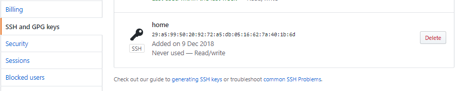

# Github - ssh key

## SSH

github 에 public ssh key 를 등록합니다.  
-&gt; push 시 매번 계정을 입력해야 되는 문제를 해결할 수 있습니다.

#### Git bash 실행

Github 이 설치되어있다면 git bash 도 설치되어 있을것 입니다. \(시작 프로그램에서 검색 또는 바탕화면에 위치\)


#### SSH Key 생성

```text
cd .ssh
ssh-keygen -t rsa
```

* .ssh 폴더로 이동한 후
* keygen 을 이용하여 ssh key 를 생성합니다.
* 계속 엔터쳐주면 됩니다.


* 위와 같은 화면이 보인다면 성공입니다.

```text
ls
cat id_rsa.pub
```

* ls 명령어는 해당 경로의 폴더와 파일들을 보여줍니다. id\_rsa 와 id\_rsa.pub 파일이 생성되었다면 성공입니다.
* cat 는 파일 텍스트를 읽을 수 있게 해주는 명령어 입니다. id\_rsa.pub 의 내용을 읽어옵니다.
* id\_rsa.pub 내용을 복사해주세요 \(공백같은게 들어가지 않도록 주의해주세요\) github 에 등록할 key 입니다.


#### Github 에 SSH key 등록하기

* github 페이지에 들어가주세요
* 오른쪽 위의 사진을 눌러 settings 탭으로 이동해주세요


-

* SSH and GPG keys 탭으로 이동해주세요
*  New SSH key 버튼을 눌러주세요




* 타이틀 \(아무거나 상관없습니다.\) 을 입력해주세요
* 아까 복사해온 id\_rsa.pub 의 key 를 붙여넣기 해주세요
* 저장해주세요.

